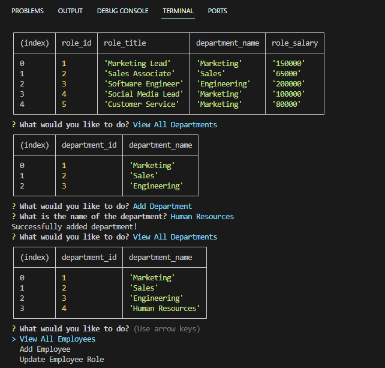

# Employee-Tracker

## Description

- This is an employee tracker that incorporates node.js and mysql to store all data.

- Using the command-line, a user is able to look through all of their employees, roles and departments

## Functions

- When first initiating the appliation the user is given a prompt on what they want to see or add to.

- Choosing one of the view all options will display a table of the given response.

- Choosing to add to one of the sections will then give you prompts to answer based on what the user chose.

- If successful, you will be shown a message saying so.

## Usage

- First before initiating the application you will have to download the dependencies through the command-line with `npm i`.

- To initiate the application run `node index.js` through the command-line.

## Sources

- Learned about self joining tables through [W3Schools](https://www.w3schools.com/sql/sql_join_self.asp) and [Stack Overflow](https://stackoverflow.com/questions/41794026/sql-join-with-the-same-table).

## Demo Video

- Watch the demo with this [link](https://watch.screencastify.com/v/vSFig2EOAaiJ0VFRrLmS).